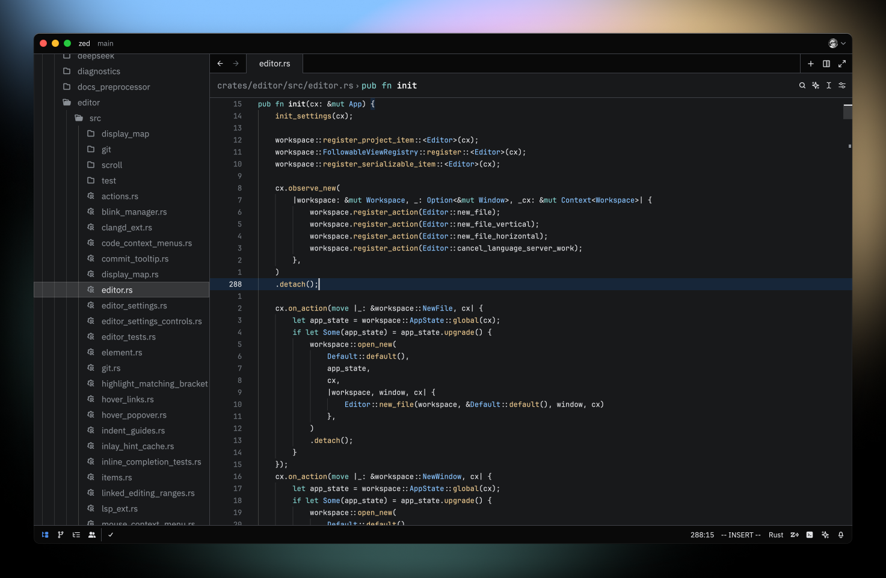
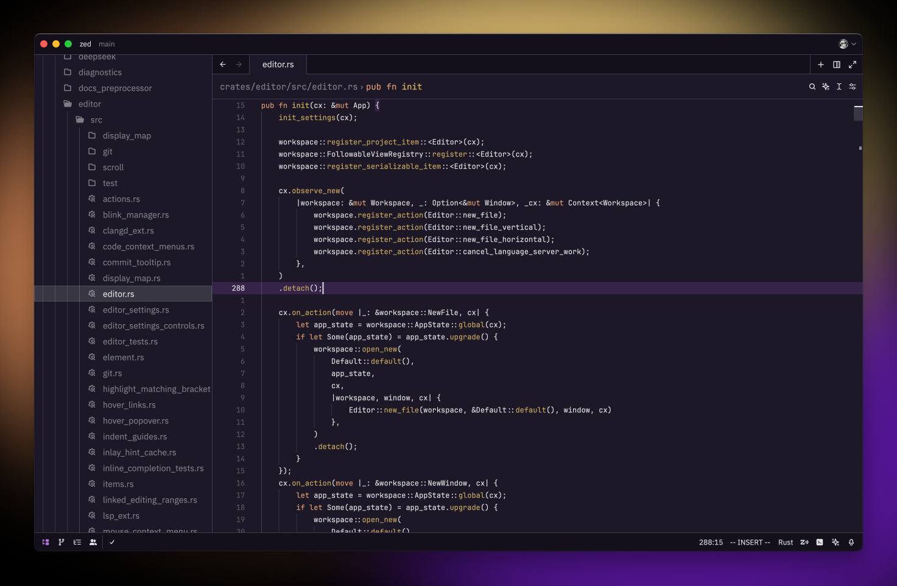
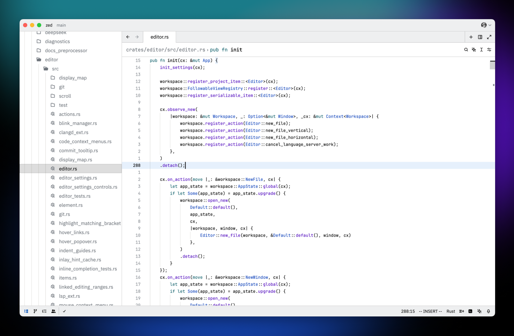

<h3 align="center">
	<br/>
	Fleet Themes for <a href="https://zed.dev/">Zed</a>
</h3>

<p align="center">


</p>

<p align="center">
Transform Zed with Fleet's sleek, modern aesthetic for a sublime coding experience.
</p>


## Preview





## Installation

You can download the themes by searching for the "Fleet Themes" extension in Zed.

## Development

This project uses [Deno](https://deno.com) to import Fleet themes into a Zed theme family. Make sure to install it before proceeding.

### Obtaining Original Themes

To get the original themes using Fleet, select each theme and run the "Edit Color Theme..." action. This will output the theme files into Fleet's custom themes directory.
- On macOS, this directory is located at: `~/Library/Application Support/JetBrains/Fleet/themes/`

### Importing Themes

Once you have the original themes, use the following command to import them:

```sh
deno run import <path-to-fleet-themes>
```

You can also use the following command to hot-reload during development:
```sh
deno run dev <path-to-fleet-themes>
```

After running the script, the imported themes will be saved to `./themes/fleet.json`.
- On macOS, the themes will also be saved to `~/.config/zed/themes/fleet.json`, allowing you to see live changes in Zed.

## Contributing

If you find any issues with the themes, or have any suggestions for improvements, please open an issue or a pull request.